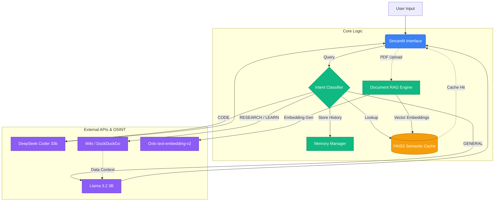
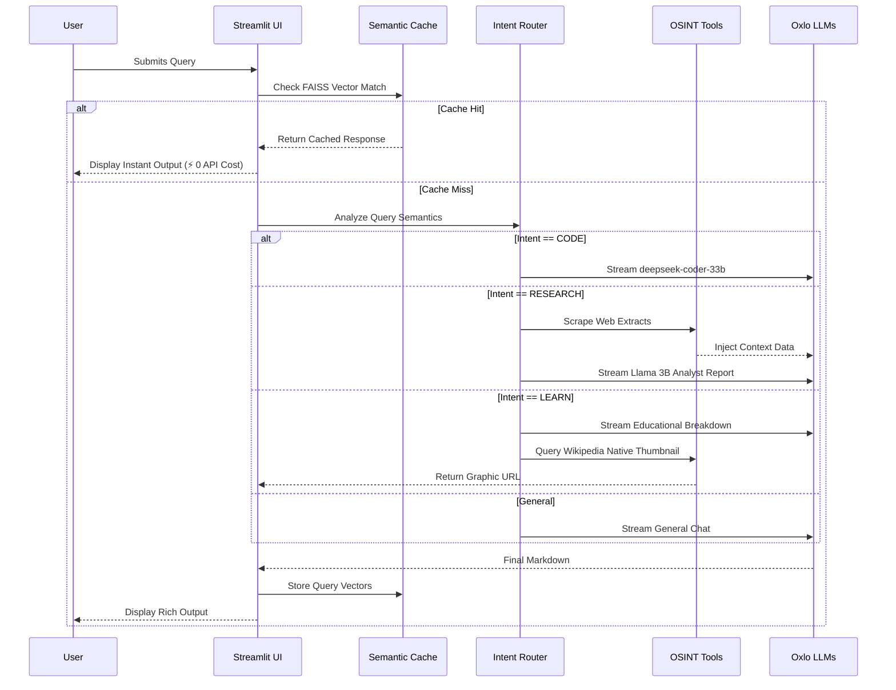

# AI Knowledge-to-Execution Copilot ⚡

A lightning-fast, highly optimized AI Copilot engineered entirely on the **Oxlo.ai** platform. Designed as an intelligent assistant that seamlessly transforms user queries into actionable output—code, structured explanations, images, and grounded knowledge. 

- **Developer / Registered Oxlo Email:** `[]`
- **Use Case:** An AI Copilot for developers and learners that reduces cognitive load by smartly classifying intent. Instead of needing different apps for writing code, understanding dense PDF documents, grasping new conceptual frameworks, or diagramming systems—this single unified interface intelligently routes queries to specialized Oxlo models.

## ✨ Key Features & Architecture

1. **Smart Intent Routing:** Every query undergoes a rapid, lightweight classification to route the prompt to the optimal model flow (Text, Code, Learn, Image).
2. **Semantic Caching & Token Economy:** Tracks exact and semantic matches of previous queries via a local Vector Store (`FAISS`). Identical concepts avoid hitting external APIs, dropping latency to ~0 seconds and saving countless tokens.
3. **Local Document Grounding (RAG):** Upload PDFs to chunk, index, and query via Oxlo's Embeddings model without the overhead of heavy orchestration frameworks.
4. **"Learning Queries" Mode:** Automatically fetches relevant visual diagrams from the Open Web (via DuckDuckGo) to accompany AI-generated structural plans when a user tries to learn a complex topic.
5. **Glassmorphic UI Engine:** Premium dark-mode aesthetics built on Streamlit with custom injected CSS, ensuring the UI looks sharp, minimalist, and responsive.

### 🏛️ System Architecture



### 🔄 Query Execution Workflow



## Models Used (Oxlo.ai exclusive)

* **General Intelligence / Intent Router:** `llama-3.2-3b` (Default Text Model)
* **Code Synthesis:** `deepseek-coder-33b` (Triggered upon `CODE` intent)
* **Knowledge Retrieval / RAG:** `bge-large`
* **Diagram Definition:** `stable-diffusion-1.5` (Image generation API)

## 🚀 Setup & Installation

### Requirements
- Python 3.10+
- Oxlo.ai API Key ([Get it here](https://portal.oxlo.ai/))

### Steps

1. Clone or download this directory.
2. Setup the virtual environment and install dependencies:
   ```bash
   python -m venv .venv
   source .venv/bin/activate  # On Windows: .venv\Scripts\activate
   pip install -r requirements.txt
   ```
3. Set your environment variables:
   Copy `.env.example` to `.env` and insert your API key.
   ```bash
   cp .env.example .env
   ```
4. Run the Copilot!
   ```bash
   streamlit run app.py
   ```

## 🐳 Docker Deployment (Recommended)

For hackathon judges and verifiers, the application has been fully containerized to ensure zero-dependency deployment.

### 1. Build the Image
Navigate to the root directory and build the container:
```bash
docker build -t oxlo-knowledge-copilot .
```

### 2. Run the Container
Run the container, securely injecting your `.env` variables and exposing the Streamlit server on port `8501`:
```bash
docker run -p 8501:8501 --env-file .env oxlo-knowledge-copilot
```
The application will be instantly live at `http://localhost:8501`!

## 🛠️ Tech Stack
- **Backend:** Python + `openai` (Oxlo-compatible wrapper)
- **Frontend:** Streamlit 
- **Vector DB / RAG:** FAISS + PyMuPDF
- **External Web Indexing:** DuckDuckGo / Wikimedia Open API

*Note: LangChain/LangGraph were intentionally avoided to minimize overhead latency and maintain maximum architectural control.*
